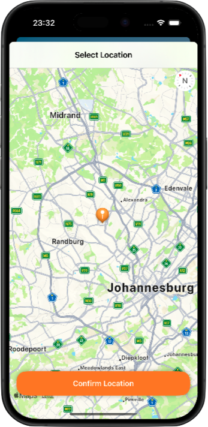
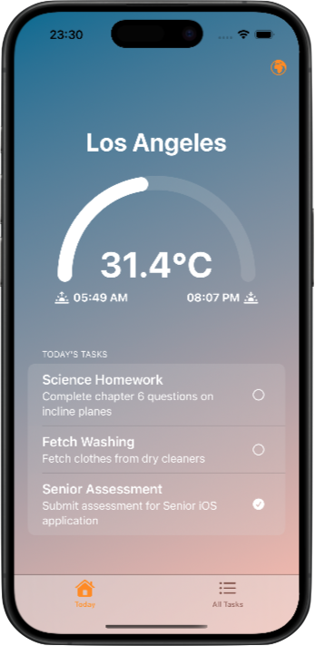
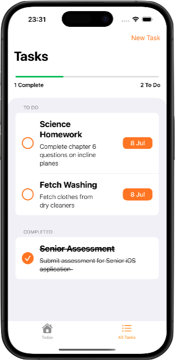
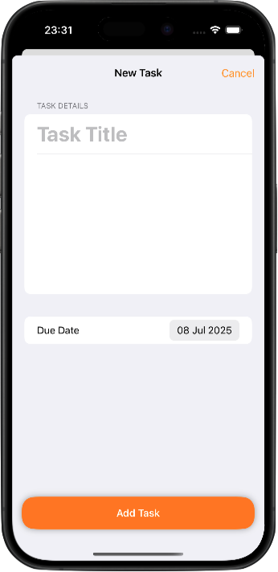

# TaskCast

TaskCast is an intuitive iOS app designed to help you organize your daily tasks while keeping you informed about your local weather conditions. By showing the current temperature along with sunrise and sunset times, TaskCast helps you plan your day around natural daylight.

---

## Features

- **Onboarding:**  
  Get started quickly by choosing to use your current location or selecting a location manually on a map.
  ---

- **Dashboard:**  
  View your daily tasks alongside up-to-date weather conditions, including temperature and sunrise/sunset times.
  ---



- **All Tasks:**  
  Browse and manage all your tasks in one place, with the ability to add new tasks easily.
  ---


---

---

## Installation

1. Clone the repository:  
    ```bash
    git clone https://github.com/Jarryd23/jarryd-senior-assesment.git
    ```
2. Create a Config/Secrets.config file that contains your API key for the weather API (API_KEY="YOUR_API_KEY")
3. Open `TaskCast.xcodeproj` in Xcode.  
4. Build and run on your simulator or device.
   

---

## Permissions

- Location permission is required to provide accurate weather data based on your current location.  
- The app requests location access on onboarding if you choose to use your current location.

---

## Technologies Used

- Swift & SwiftUI  
- Core Location for location services.  
- Integration with WeatherAPI for real-time weather data.  
- Realm for reactive data persistence

---
